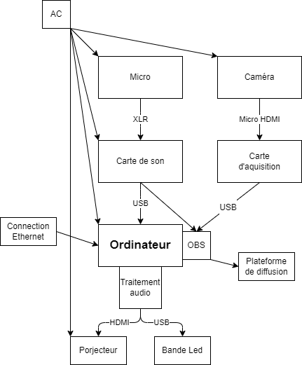

# ConcertNow / ConcertEnDirect

## Concept
ConcertEnDirect est un projet mélangeant la misique et le multimédia. Ce projet propose aux musiciens amateurs une expérience leur permettant de s'imaginer en train de donner un concert. 

Pour ce faire, le projet consisterait en un processus de traitement du son émis par l'utilisateur (via un instrument ou un micro). Le son reçu serait alors traité pour générer une expérience visuelle dynamique et interactive. L'expérience pourait être diffusée en direct sur une plateforme publique telle que Twitch, YouTube, Kick, TikTok... afin de permettre à l'utilisateur d'avoir une audience, même si celle-ci n'est pas physique. (L'utilisateur peut mettre son propre compte afin de diffuser son contenue sur la plateforme de son choix.)

## Scénario
Plusieurs instruments seront mis à disposition de l'utilisateur (guitare, piano, percussions, micro...). L'utilisateur aura donc le choix de l'instrument qu'il souhaite utiliser et de ce qu'il veut jouer. Le son sera ensuite traité et transformé en lumière et en vidéo.

Les percussions auraient un effet important sur les lumières, qui clignoteraient au rythme joué. Les instruments mélodiques, comme les guitares, pianos, voix... seraient représentés par des projections et des jeux de lumières. Chaque instrument aurait une couleur spécifique, qui changerait de teinte en fonction de sa fréquence et d'intensité selon son volume.

Le tout disposé devant une caméra pour la diffusion du jam.

````mermaid
graph TD;

    A[Veille] --> B{Son de l'utilisateur};
    B --> C;
    C[Son traité dans le logiciel];
    C -->|Vidéo| E[Projection lancée];
    C -->|Lumière| F[Effets lumineux];

    E --> H{Interaction terminée ?};
    F --> H;


     E --> n2;
    F --> n2;


    H -->|Oui| I[Retour à veille];
    H -->|Non| C;
````
## Scénarimage


## Synoptique



## Plantation


## Technologies

Pour ce projet les technologies nécésaires seront: 
- Projecteur
- Lumière LED
- Ordinateur
- Instruments de musique
- Micro
- Cable XLR
- Caméra
- Carte d'aquisition vidéo

Et les logiciels nécéssaires seront: 
- Touch Designer
- QLC +
- Plugdata
- MidiLoop
- OBSstudio
- Site de diffuion (twitch, yt, tiktok, kick...)
